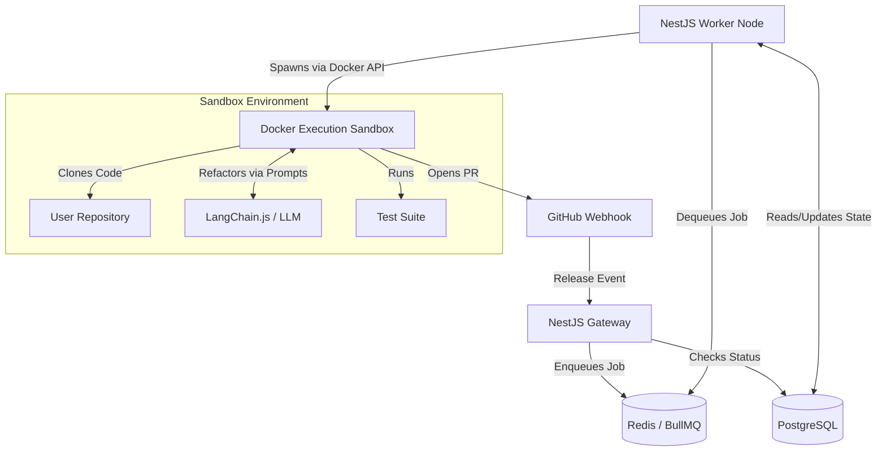
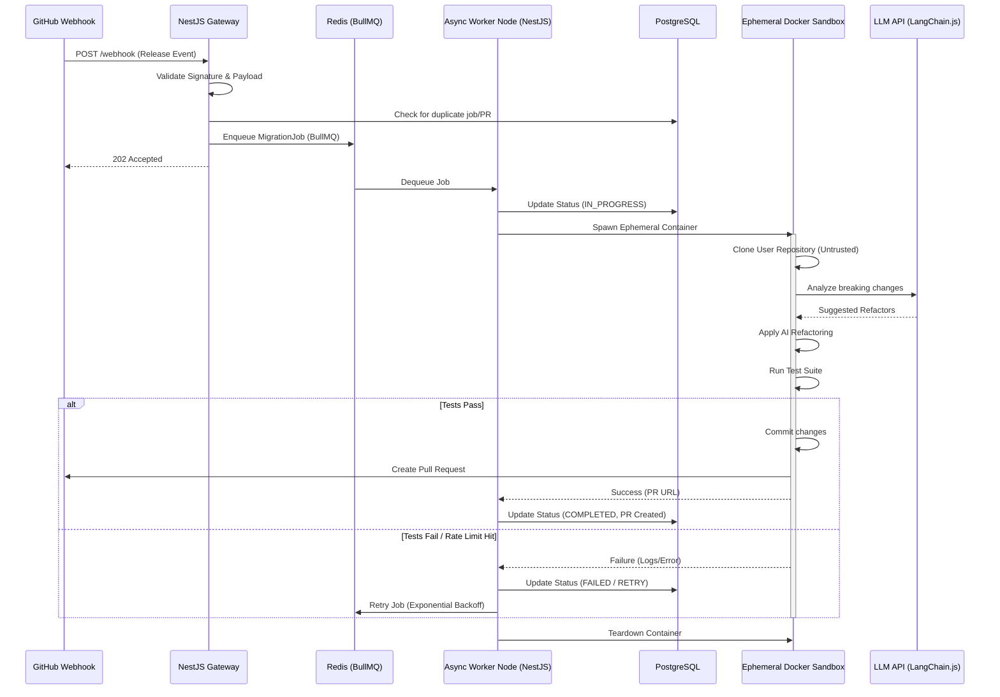

# 00 - Architecture Overview

This document provides a high-level overview of the Autonomous API Migration Agent, detailing how the components interact and the lifecycle of a webhook event.

## High-Level Component Diagram

## Data Flow Sequence

Here is the step-by-step lifecycle of a webhook event, from API ingestion to the final Pull Request.

