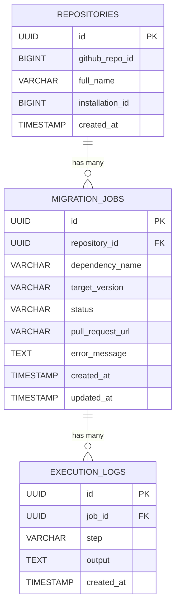

# 02 - Database & Queue Management

This document defines the data models and queue strategies used by the agent to ensure transactional integrity and idempotency.

## Entity-Relationship Diagram



## SQL Schema (PostgreSQL)

```sql
-- Repositories: Tracks user subscriptions and permissions
CREATE TABLE repositories (
    id UUID PRIMARY KEY DEFAULT gen_random_uuid(),
    github_repo_id BIGINT UNIQUE NOT NULL,
    full_name VARCHAR(255) NOT NULL,
    installation_id BIGINT NOT NULL, -- For GitHub App auth
    created_at TIMESTAMP WITH TIME ZONE DEFAULT NOW()
);

-- MigrationJobs: Tracks the queue state and idempotency
CREATE TABLE migration_jobs (
    id UUID PRIMARY KEY DEFAULT gen_random_uuid(),
    repository_id UUID REFERENCES repositories(id),
    dependency_name VARCHAR(255) NOT NULL,
    target_version VARCHAR(50) NOT NULL,
    status VARCHAR(50) NOT NULL DEFAULT 'QUEUED', -- QUEUED, IN_PROGRESS, COMPLETED, FAILED
    pull_request_url VARCHAR(255),
    error_message TEXT,
    created_at TIMESTAMP WITH TIME ZONE DEFAULT NOW(),
    updated_at TIMESTAMP WITH TIME ZONE DEFAULT NOW(),
    UNIQUE(repository_id, dependency_name, target_version) -- Prevents duplicate migrations
);

-- ExecutionLogs: Audit trail and debugging (append-only)
CREATE TABLE execution_logs (
    id UUID PRIMARY KEY DEFAULT gen_random_uuid(),
    job_id UUID REFERENCES migration_jobs(id) ON DELETE CASCADE,
    step VARCHAR(100) NOT NULL, -- e.g., 'CLONE', 'LLM_REFACTOR', 'TEST', 'PR'
    output TEXT,
    created_at TIMESTAMP WITH TIME ZONE DEFAULT NOW()
);
```

## Queue & State Strategy

### Handling LLM Rate Limits
- **Backpressure & Concurrency Limits:** Configure BullMQ to limit the number of concurrently active jobs across worker nodes.
- **LangChain.js Integration:** Implement interceptors to catch `429 Too Many Requests`. If caught, gracefully fail the job to let BullMQ handle the retry.

### Job Retries & Exponential Backoff
- **BullMQ Retry Strategy:** Configure BullMQ with an exponential backoff strategy (e.g., 2 minutes, 4 minutes, 8 minutes).
- **Idempotency:** The worker will check PostgreSQL before spawning a container. If the job status is already `COMPLETED` or a PR is open, it skips execution.

### State Tracking & Race Conditions
- **Strict Transactional Integrity:** Use PostgreSQL transactions and explicit locking (e.g., `SELECT ... FOR UPDATE`) when starting a job.
- **Unique Constraints:** PostgreSQL enforces a `UNIQUE (repository_id, dependency_name, target_version)` constraint to prevent duplicate PRs from being created if a webhook is fired multiple times for the same release.
